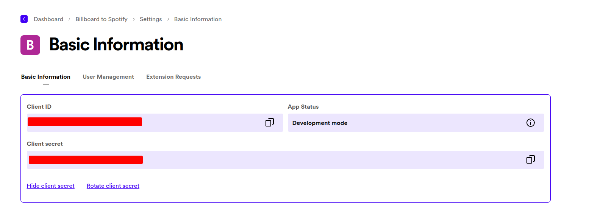
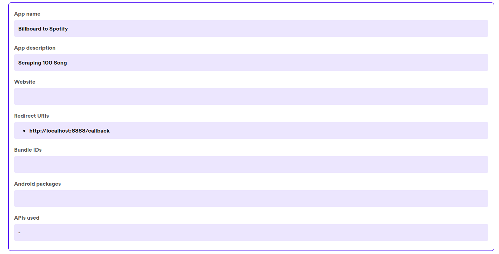
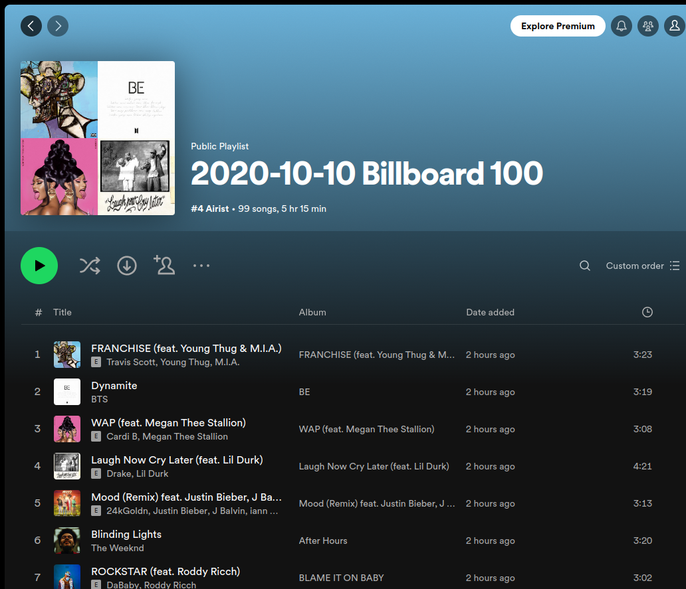

### Create Spotify Application

- Scraping billboard song, https://www.billboard.com/charts/hot-100/

1. https://developer.spotify.com/, Sign Up
2. Dashboar > Create App
3. Save CLIENT_ID, CLIENT_SECRET



4. Setting Redirect URI



5. Save CLIENT_ID & CLIENT SECRET > env.py

```bash
CLIENT_ID = "XX"
CLIENT_SECRET = "XX"
```

6. Run Program

```bash
python main.py
--
example-input: 2023-10-10
```
